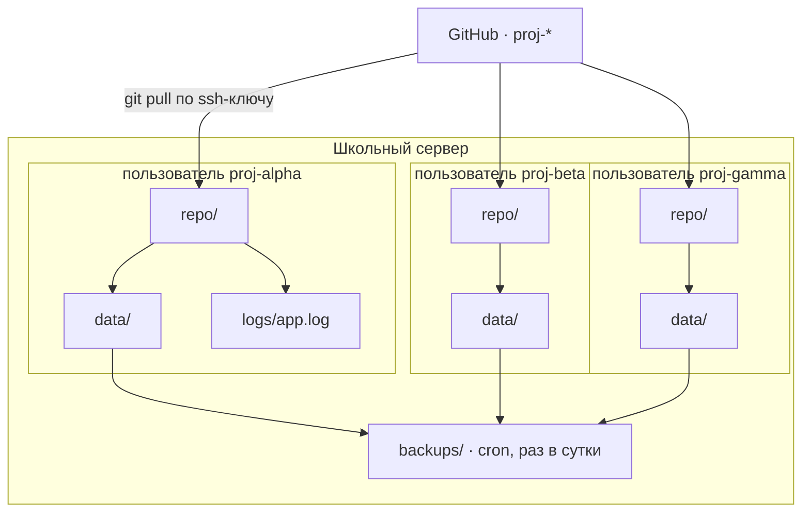

# Серверный кластер

> ⚠️ **Сверено с ревизией сервера: НЕТ.**
> Документ написан до того, как `docs/INFRA.md` появился. Всё ниже — целевая картина
> и набор допущений, а не описание реальности. Ревизия назначена группе B на 22.09;
> после неё строку заменить на «сверено: да, дата» и снять пометки допущений.

Архитектура приложений — отдельный документ: [ARCHITECTURE.md](ARCHITECTURE.md).

---

## 1. Принцип

Три независимых проекта на одной машине. **Никакого оркестратора, Docker и общей шины.**
Изоляция делается средствами операционной системы — потому что это ровно тот навык,
ради которого стоит трогать настоящий сервер.

Соблазн собрать «кластер» как единую систему надо назвать и отбросить: связанность здесь
не даёт ничего, кроме общих отказов. Три проекта не знают друг о друге и не должны.

---

## 2. Топология

```text
/srv/realschool/
├── proj-alpha/            владелец proj-alpha:realschool, права 750
│   ├── repo/              git clone; деплой = git pull
│   ├── data/              JSON; НЕ в git; сюда пишет программа
│   ├── logs/app.log
│   └── venv/              свой на проект
├── proj-beta/             то же самое
├── proj-gamma/            то же самое
└── backups/               cron: раз в сутки tar каждого data/
```



```text
   GitHub proj-*  ──git pull──►  /srv/realschool/<proj>/repo/
                                          │
                                          ├──► data/  ──► backups/  (cron, сутки)
                                          └──► logs/app.log

   изоляция: свой пользователь ОС на проект · ssh по ключу · без sudo
   портов нет: все три проекта консольные
```

---

## 3. Решения

| Что | Как | Почему так |
|---|---|---|
| Изоляция | системный пользователь на проект, общая группа `realschool` | команда физически не может сломать чужой проект; права перестают быть абстракцией |
| Доступ | ssh **по ключу**, личный ключ каждого студента в `authorized_keys` своего проекта | личный вход при командном доступе; первый настоящий разговор о том, почему не пароль |
| Зависимости | `venv` на проект | даже при нулевых зависимостях: привычка и защита от «поставил глобально — сломал всем» |
| Деплой | `git pull` в `repo/` | понятно школьнику, не требует CI. Docker у группы B есть, но здесь он лишний слой |
| Запуск | нед. 3–6 вручную по ssh, нед. 7 — `cron` | systemd вводится, только если появится боль «должно подниматься само» |
| **Порты** | **не нужны вообще** | всё консольное. Это разом снимает половину инфраструктурных рисков. 8081–8083 зарезервировать на случай веба, но не открывать |
| Логи | `>> logs/app.log` | ротация на восемь недель не нужна |
| Бэкапы | `cron` + `tar` каталога `data/` | одна строка в crontab; восстановление понятно без инструментов |
| sudo | **студентам не выдаётся** | и это проговаривается вслух, с объяснением |

---

## 4. Что делает кто

| Роль | Права |
|---|---|
| Ты | владелец всего, заводишь пользователей |
| Группа B | ssh во все три проекта, пишут инструкцию по деплою, ведут пятничный деплой |
| Команда | ssh только в свой проект |
| Студент вне команды | нет доступа |

Группа B здесь не «сильные, которым скучно», а те, на ком держится инфраструктура —
[так и сформулировать](WEEK-03.md#роль-группы-b).

---

## 5. Порядок внедрения

| Когда | Что |
|---|---|
| Вт 22.09 | Ревизия: что на сервере вообще есть → `docs/INFRA.md` |
| Чт 24.09 | Каталоги и пользователи, ssh-ключи студентов |
| Пт 25.09 | Первый деплой: `git pull`, ручной запуск, вывод в `logs/` |
| Нед. 7 | `cron` для запуска и для бэкапа |

---

## 6. Фоллбэки

Ревизия может принести плохие новости. Заранее решено, что делаем.

| Что выяснится | Что делаем |
|---|---|
| Нельзя заводить пользователей ОС | Один пользователь, три каталога. Изоляция только каталогами — слабее, но работает |
| ssh только изнутри класса | Деплой делается из класса. На восемь недель приемлемо |
| Python 3 старый или отсутствует | Пробуем поставить. Если нельзя — «прод» имитируется отдельным каталогом на машине класса. Признать это честно и записать, а не делать вид, что деплой состоялся |
| Нет прав на `cron` | Запуск и бэкап вручную, по чеклисту дежурного. Заодно урок: автоматизация доступна не всегда |
| Нет места на диске | `data/` чистится, бэкапы хранятся за три дня |
| Сервера фактически нет | Неделя 3 заканчивается на localhost, неделя 7 переезжает на любую доступную машину. Программа от этого не рушится — рушится только фраза «в проде» |

---

## 7. Что проверить в ревизии

Полный чеклист выдан группе B: [LESSON-04.md](LESSON-04.md#чеклист-ревизии-сервера--для-группы-b).
Ключевое для этого документа: можно ли заводить пользователей, работает ли ssh по ключу,
есть ли `cron`, и **что нельзя трогать ни при каких условиях**.

Последний пункт — не формальность. Ответ на него пишется в `INFRA.md` дословно, словами админа.
