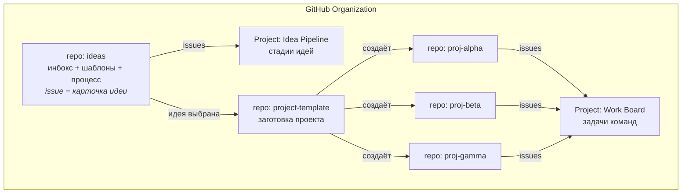

# Инбокс идей и работа с проектами на разных стадиях

Черновик решения для следующего шага — устройство организации на GitHub. Здесь предложение
и обоснование; настраивать будем отдельно.

---

## 1. Что именно надо решить

Проекты одновременно находятся в разных состояниях: одна идея только что заброшена в инбокс,
вторая обсуждается, третья пишется, четвёртая уже в проде и падает по ночам. Нужна одна система,
в которой видно все четыре, и при этом она не превращается в трекер, который никто не открывает.

Требования:

1. Порог входа — минуты. Школьник должен суметь завести идею с телефона.
2. Стадия каждого проекта видна с одного экрана, без объяснений.
3. Авторство идеи фиксируется навсегда.
4. У команды есть «свой» репозиторий — это сильный мотиватор.
5. Всё переживает твой отъезд.

---

## 2. Три варианта

| | A. Один моно-репозиторий | B. Org: инбокс + репо на проект | C. Только доска (Projects) |
|---|---|---|---|
| Идеи | папка `ideas/*.md` через PR | issue в репо `ideas` через форму | карточки на доске |
| Проекты | папки в том же репо | отдельный репозиторий каждый | нет кода — только карточки |
| Порог входа | высокий (PR ради идеи) | низкий (форма) | самый низкий |
| «Свой репозиторий» у команды | нет | да | нет |
| Отдельный CI/релиз/README на проект | плохо | да | нет |
| Права по командам | нет | да (teams) | — |
| Сложность настройки | низкая | средняя | низкая |

**Рекомендация: вариант B.** Главный аргумент не технический: собственный репозиторий с
собственной историей коммитов — это то, что студент потом покажет. Плюс он даёт настоящие
права, ветки и CI, то есть ровно ту среду, ради которой всё затевается.

Вариант A выглядит проще, но PR ради идеи убьёт инбокс на второй неделе.

---

## 3. Предлагаемая структура организации



```text
   ORGANIZATION
   |
   +-- repo: ideas ............... инбокс. 1 issue = 1 идея (форма)
   |      +-- ISSUE_TEMPLATE/idea.yml
   |      +-- docs/  (правила, программа, материалы занятий)
   |
   +-- repo: project-template ... заготовка: README, LICENSE, PRD, CI, шаблон PR
   |
   +-- repo: proj-alpha ......... команда 1   -----+
   +-- repo: proj-beta .......... команда 2   -----+--> Work Board (задачи)
   +-- repo: proj-gamma ......... команда 3   -----+
   |
   +-- Project "Idea Pipeline" .. стадии идей (Inbox -> ... -> Archived)
   +-- Project "Work Board" ..... канбан задач (Todo / Doing / Review / Done)
```

---

## 4. Две доски, а не одна

Это ключевое решение. Смешивать «идею на стадии обсуждения» и «задачу на два часа» на одной
доске — гарантированный хаос.

**Доска 1 — Idea Pipeline** (уровень организации, источник: issues репозитория `ideas`).
Колонка = стадия из [ROADMAP.md §3](ROADMAP.md#3-жизненный-цикл-идеи):

```
Inbox | Triage | Too big | Parked | Shaping | Ready | Building | Released | Operating | Archived
```

Одна карточка живёт весь путь — от «накидал на телефоне» до «работает в школе». Issue идеи
**не закрывается при старте разработки**: она становится карточкой проекта и закрывается
только на `Archived`. Так на одном экране видно портфель целиком.

**Доска 2 — Work Board** (источник: issues всех `proj-*`, поле `Team` для фильтра).
Обычный канбан:

```
Todo | In progress | In review | Done
```

Здесь живут задачи на часы и дни. Студент работает только с этой доской; первая нужна
в основном на занятиях по отбору.

Поля Projects (v2), которые стоит завести: `Stage`, `Team`, `Owner`, `Customer` (заказчик из школы),
`Iteration`, `Size` (S/M/L — без story points).

---

## 5. Форма для идеи вместо свободного текста

`ideas/.github/ISSUE_TEMPLATE/idea.yml` — Issue Form с обязательными полями, один в один
с [карточкой идеи](../templates/idea-card.md):

- Название идеи
- Кто страдает
- Что происходит
- Как часто
- Как выкручиваются сейчас
- Откуда я это знаю (наблюдение / предположение)
- Что предлагаю
- Версия на две недели
- Чего НЕ будет в первой версии
- Как поймём, что стало лучше
- Кто в школе скажет «мне подходит»

Форма — это тихий способ научить думать: нельзя отправить идею, не ответив на вопрос «кто страдает».
Обязательными делаем поля 1–6; остальные можно дозаполнить на разборе.

---

## 6. Метки

| Группа | Метки | Зачем |
|---|---|---|
| Стадия | `stage:inbox` `stage:triage` `stage:shaping` `stage:building` `stage:released` `stage:operating` `stage:parked` `stage:archived` | дублирует поле доски, зато видно в списке issue |
| Тип | `type:idea` `type:bug` `type:feature` `type:chore` `type:docs` | |
| Размер | `size:S` `size:M` `size:L` | S = один вечер, M = неделя, L = слишком много, дробить |
| Сигналы | `needs-owner` `too-big` `blocked` `good-first-issue` `help-wanted` | |
| Приоритет (с фазы Operate) | `p0:падает` `p1:мешает` `p2:раздражает` `p3:хотелка` | язык дежурного по багам |

Больше меток на старте не заводить. Каждая метка, которую никто не ставит, обесценивает остальные.

---

## 7. Переход идеи в проект (ритуал, а не формальность)

1. Идея прошла фильтр → `Shaping`, назначен owner и заказчик.
2. Команда пишет `PRD.md` прямо в комментарии к issue.
3. Из `project-template` создаётся `proj-<name>`, в issue идеи вставляется ссылка на репозиторий.
4. Идея переезжает в `Building`, создаётся GitHub Team с правами write на этот репозиторий.
5. Первая задача в новом репо — всегда walking skeleton, не фича.

Делать это публично на занятии, за 10 минут: момент «наша идея превратилась в репозиторий» —
сильный, его стоит не потерять в переписке.

---

## 8. Права и защита

- Студенты: `write` в свой `proj-*`, `read` везде, `triage` в `ideas` (могут заводить и метить issue).
- Учитель информатики: `owner` организации — с первого дня, не в конце.
- Ты: `owner`.
- Branch protection на `main` (требовать PR + 1 approval) — включать **на неделе 5–6**, когда
  случится первый сломанный main. Раньше — это правило без причины.
- Никаких секретов в репозиториях; разговор про `.gitignore` и пароли — до первого коммита.

---

## 9. Публичность

- `proj-*` — публичные. Это портфолио и часть мотивации.
- `ideas` — **приватный на старте**. В карточках будут наблюдения вида «в столовой всегда бардак»
  и имена сотрудников школы; публиковать такое без разговора с администрацией не стоит.
  Открыть можно позже, осознанно.
- В публичных репозиториях — никаких персональных данных учеников, ни в коде, ни в тестовых данных.

---

## 10. Что сознательно не берём

- GitHub Discussions — лишняя поверхность, инбокс размажется между issue и обсуждениями.
- Wiki **как источник правды** — документация живёт в репозитории, рядом с кодом, и попадает
  под review. Но Wiki включена как витрина: она генерируется из `docs/` при каждом пуше в `main`
  (`scripts/sync-wiki.sh` + workflow `sync-wiki.yml`). Править страницы прямо в Wiki бессмысленно —
  перезапишет следующая синхронизация. Это рабочий компромисс и заодно первый пример
  автоматизации, который студенты увидят до того, как дойдут до CI.
- Milestones — итерации закрываются полем `Iteration` на доске.
- Автоматизации и боты — до тех пор, пока ручной процесс не заработает. Автоматизировать
  неработающий процесс бессмысленно.

---

## 11. Вопросы к тебе перед настройкой

- [x] Имя организации — `RealSchoolPool` ✅
- [ ] Сколько будет команд — от этого зависит, сколько `proj-*` заводить сразу?
- [ ] `ideas` приватный или публичный — обсуждали ли с администрацией школы?
- [ ] Кто из учителей станет вторым owner?
- [ ] Язык issue-форм: армянский, русский, английский или двуязычно?
- [ ] Нужен ли отдельный репозиторий `handbook` под саму программу и материалы занятий,
      или на старте это папка `docs/` внутри `ideas`?
