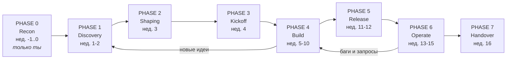
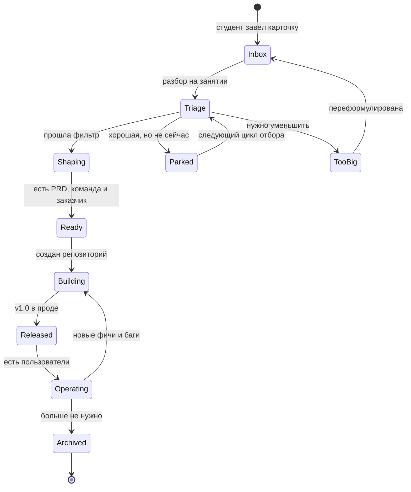
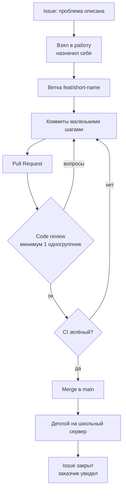

# RealSchoolHub — Roadmap (draft)

> ⚠️ **Фактические параметры программы: 8 недель, 12 студентов.** Основной текст ниже написан
> под 16 недель и требует пересборки — см. §1a «Сжатая версия на 8 недель». Всё, что не касается
> сроков (принципы, жизненный цикл идеи, путь задачи, таблица «боль → инструмент»), применимо как есть.

Черновик программы. Всё, что ниже, — предмет для спора, а не догма.

Схемы даны дважды: блоком `mermaid` (GitHub рендерит сам) и ASCII-версией — чтобы читалось в любом
редакторе, без дополнительных инструментов.

---

## 0. Принципы, на которых держится план

1. **Планируем назад от даты окончания.** Размер проекта — производная от срока, не наоборот.
2. **Инструмент вводится в день боли**, а не «потому что так в индустрии».
3. **Каждые две недели — работающая демонстрация** живому заказчику. Не слайды, не отчёт — запуск.
4. **Вертикальный срез раньше глубины.** Сначала сквозной тонкий путь «вход → результат», потом фичи.
5. **Ничего не живёт в мессенджере.** Решение, которого нет в репозитории, не существует.
6. **Передача — фича, а не прощание.** Мейнтейнеры растятся с первой недели.

---

## 1. Карта фаз



```text
 нед.  -1  0 | 1   2 | 3 | 4 | 5  6  7  8  9 10 | 11 12 | 13 14 15 | 16
       [Recon]  [Discovery] [Sh] [KO] [ ---- Build ---- ] [Release] [Operate] [HO]
          |          |       |    |     |     |     |         |          |       |
       инфра     инбокс   выбор  репо  итер1 итер2 итер3   v1.0 в прод  дежурства  демо-день
       ревизия   идей     тем    доска  демо  демо  демо   реальные     хотфиксы   передача
                                                            юзеры
                 ^                                              ^
                 |                                              |
            ДЗ-1 сдаётся                                  первый настоящий
            (карточки идей)                               инцидент = лучший урок
```

---

## 1a. Сжатая версия на 8 недель (12 студентов)

8 недель — это ровно половина. Сжимать нужно не все фазы пропорционально, а **резать размер
проектов и число итераций**, сохранив фазу эксплуатации: именно она — то, ради чего всё затевалось,
и именно её обычно приносят в жертву первой.

| Неделя | Фаза | Что происходит |
|---|---|---|
| −1 | Recon | Ревизия сервера, поиск заказчиков, создание org `RealSchoolPool`, инбокс |
| 1 | Discovery | Занятие 1: правила, рамки, выдача ДЗ-1 |
| 2 | Discovery + Shaping | Брейншторм по карточкам, выбор 3 идей, сбор команд, PRD |
| 3 | Kickoff | Репозитории, первый коммит от каждого, **walking skeleton на школьном сервере** |
| 4–5 | Build, iter 1 | Главный сценарий end-to-end. Вводим ветки, PR, review. Демо заказчику в конце нед. 5 |
| 6 | Build, iter 2 (короткая) | Обработка ошибок, доводка. Вводим тесты + CI. Демо |
| 7 | Release | Тег v1.0.0, деплой, README, передача пользователям |
| 8 | Operate + Handover | Неделя реальной эксплуатации, дежурство по багам, Demo Day, передача мейнтейнерам |

Что меняется по сравнению с 16-недельной версией:

- **Две итерации вместо трёх**, вторая — короткая.
- **Discovery и Shaping слиты в неделю 2.** ДЗ-1 делает discovery асинхронным — это единственная
  причина, почему такое сжатие вообще возможно.
- **Фаза Operate сжата до одной недели** — этого хватает ровно на один настоящий инцидент.
  Инцидент стоит спровоцировать (выключить сервис, сломать вход) — иначе урока не будет.
- **Handover не отрезается ни при каких обстоятельствах.** При отставании режется объём v1.0,
  не передача.
- Из таблицы «боль → инструмент» (§5) реально успеваем строки 1–6 и 9. Строки 7, 8, 10 —
  показываем на живом примере, но не требуем.

**Состав:** 12 студентов → **3 команды по 4**. Не 2 по 6: в команде из шести при 8 неделях
двое гарантированно окажутся пассажирами. Роли внутри команды (тимлид, релиз-менеджер,
дежурный по багам) меняются между итерациями — при 4 участниках каждый успевает побывать в трёх ролях.

**Размер проекта под 8 недель:** одна команда — один сценарий. CLI-утилита, бот, скрипт по cron,
TUI. Ничего, что требует и бэкенда, и интерфейса одновременно.

---

## 2. Фазы по одной

### PHASE 0 — Recon (неделя −1 … 0). Студенты не участвуют

Единственная фаза, где ты работаешь один. Цель — убрать инфраструктурные сюрпризы из учебного времени.

| Задача | Артефакт |
|---|---|
| Ревизия школьного сервера и ОС | `docs/INFRA.md` |
| Проверить: python3 --version, компилятор + стандарт C++, git, ssh, cron/systemd, свободный порт, бэкапы | там же |
| Выяснить, кто админ сервера и как выдаются доступы | там же |
| Найти 3–5 потенциальных заказчиков внутри школы и поговорить с ними | `docs/STAKEHOLDERS.md` |
| Узнать позицию школы про публичность и согласие родителей | `docs/POLICY.md` |
| Создать организацию на GitHub, добавить учителя информатики как owner | org |
| Настроить `ideas` (инбокс) и общую доску | см. IDEA-PIPELINE.md |

**Выход из фазы:** известно, что реально можно задеплоить и кому это нужно.
**Если не сделано — не начинать PHASE 1.** Это единственный жёсткий гейт в плане.

---

### PHASE 1 — Discovery (недели 1–2). Идеи и рамки

Цель: научить отличать *проблему* от *решения* и наполнить инбокс.

- Занятие 1: зачем всё это, правила игры, рамки для идей, выдача **[ДЗ-1](HOMEWORK-01.md)**.
- Между занятиями: студенты кидают карточки идей в инбокс.
- Занятие 2: брейншторм — разбор карточек вслух, группировка, поиск дубликатов, «уменьшение» крупных идей.

**Артефакты:** 15–30 карточек идей в инбоксе, у каждой есть автор.
**Демо-критерий фазы:** любая идея из инбокса может быть пересказана за 60 секунд по схеме
«кто страдает → что происходит → как поймём, что стало лучше».

---

### PHASE 2 — Shaping (неделя 3). Выбор и команды

- Прогон идей через фильтр (см. таблицу «фильтр идеи» ниже).
- Выбираем **3 проекта** — не голосованием большинства, а сведением: «эта идея жизнеспособна, у неё
  есть заказчик, есть 3 человека, готовых её делать».
- Формируем команды 3–4 человека. Роли: тимлид, релиз-менеджер, дежурный по багам — **ротируются
  каждую итерацию**.
- Каждая команда пишет одностраничный `docs/PRD.md`: проблема, пользователь, MVP, anti-scope, метрика успеха.

**Фильтр идеи (проходит, если все «да»):**

| Критерий | Проверка |
|---|---|
| Есть живой пользователь | Можно назвать имя и позвать в класс |
| Влезает в срок | Первая работающая версия за 2 недели |
| Влезает в стек | Python или C++, школьный сервер |
| Безопасно | Нет персональных данных учеников |
| Бесплатно | Не требует покупок и платных сервисов |
| Проверяемо | Понятно, как измерить «стало лучше» |

---

### PHASE 3 — Kickoff (неделя 4). Инфраструктура проекта

Первая техническая неделя. Задача — не написать фичу, а **пройти путь до конца на тонком срезе**.

- Репозиторий проекта, README, LICENSE, `.gitignore`.
- Первый коммит от каждого участника (важно: каждого — не только самого быстрого).
- **Walking skeleton**: программа, которая делает ровно одну бессмысленную вещь, но целиком —
  принимает вход, что-то возвращает, запускается на школьном сервере. Пусть это будет
  «hello, %username%». Главное — маршрут «код → репозиторий → сервер» пройден на неделе 4, а не на 11.
- Определить Definition of Done для задачи (см. ниже).

**Выход:** на школьном сервере крутится что-то, написанное студентами, пусть и тривиальное.

---

### PHASE 4 — Build (недели 5–10). Три итерации по две недели

Каждая итерация: планирование (30 мин) → работа → **демо заказчику** → ретро (20 мин).

| Итерация | Недели | Фокус | Что вводим |
|---|---|---|---|
| Iter 1 | 5–6 | Главный сценарий работает end-to-end | ветки, PR, code review |
| Iter 2 | 7–8 | Второй сценарий + обработка ошибок | тесты, CI, issue-гигиена |
| Iter 3 | 9–10 | Полировка, доки, подготовка релиза | версионирование, CHANGELOG |

**Правило демо:** показывает не тимлид, а тот, кто меньше всех выступал. Демо — это запуск
на сервере, не рассказ.

**Ретро — три вопроса, 20 минут, письменно в репозиторий:** что помогло, что мешало,
что меняем в следующей итерации (ровно один пункт).

---

### PHASE 5 — Release (недели 11–12). В прод

- Тег `v1.0.0`, CHANGELOG, README с инструкцией запуска (проверяется буквально: чужой человек по
  README запускает проект — не получилось, README плохой).
- Деплой на школьный сервер: автозапуск (systemd/cron), логи, бэкап данных.
- Передача пользователям: короткая инструкция на родном языке, канал для жалоб (issue или чат).
- Разговор про то, чего не бывает в учебных проектах: откат, «как понять, что оно упало», кто чинит.

---

### PHASE 6 — Operate (недели 13–15). Настоящая поддержка

Самая недооценённая и самая ценная фаза. Здесь студенты впервые получают обратную связь
от мира, а не от преподавателя.

- **Дежурство по багам**: на каждую неделю один дежурный в команде, он принимает жалобы и заводит issue.
- Приоритизация: «падает» → «мешает» → «раздражает» → «хотелка».
- Хотфикс vs плановая задача — разница на живом примере.
- Метрика: считаем реальные обращения/использования. Цифра из жизни, а не из головы.
- Первый настоящий инцидент — самый ценный урок программы; не спасать команду слишком быстро.

---

### PHASE 7 — Handover (неделя 16). Demo Day и передача

- **Demo Day**: учителя, родители, заказчики. Каждая команда — 5 минут: проблема, решение, цифры,
  что сломалось и как чинили.
- Передача мейнтейнерам: у каждого проекта 2 студента с правами и записанным `docs/MAINTENANCE.md`.
- Учитель информатики — owner организации.
- Финальное ретро по всей программе → в репозиторий с процессом, для следующего волонтёра.

---

## 3. Жизненный цикл идеи



```text
                    +---------+
   студент  ----->  |  INBOX  |  <-----------------------+
   завёл            +----+----+                          |
   карточку              |  разбор на занятии            | переформулировал
                         v                               |
                    +---------+      too-big      +------+------+
                    | TRIAGE  |------------------>|   TOO BIG   |
                    +----+----+                   +-------------+
                     |       \  не сейчас
            прошла   |        \-----------> +--------+
            фильтр   |                      | PARKED |---+ следующий отбор
                     v                      +--------+   |
                +---------+    <-------------------------+
                | SHAPING |  PRD + команда + заказчик
                +----+----+
                     v
                +---------+    +----------+    +-----------+    +-----------+
                |  READY  |--->| BUILDING |--->| RELEASED  |--->| OPERATING |
                +---------+    +----+-----+    +-----------+    +-----+-----+
                                    ^                                 |
                                    +----- баги и новые фичи ---------+
                                                                      |
                                                                      v
                                                               +----------+
                                                               | ARCHIVED |
                                                               +----------+
```

Ключевое: из `Triage` **не бывает выхода «удалить»**. Идея либо едет, либо ждёт, либо
уменьшается. Автор всегда указан.

---

## 4. Путь одной задачи (вводится в Iter 1)



```text
  ISSUE --> взял в работу --> ВЕТКА --> коммиты --> PULL REQUEST
                                                        |
                                            +-----------+
                                            v
                                    [ CODE REVIEW ]
                                      |          |
                                вопросы          ок
                                      |          v
                                      |      [   CI   ]
                                      |       |      |
                                      |    красный  зелёный
                                      |       |      |
                                      +<------+      v
                                   (правим)       MERGE в main
                                                     |
                                                     v
                                              ДЕПЛОЙ на сервер
                                                     |
                                                     v
                                          ISSUE ЗАКРЫТ (заказчик видел)
```

**Definition of Done для задачи** (вешается на стену и в шаблон PR):

1. Код в `main`, ветка удалена.
2. Кто-то другой посмотрел и понял.
3. Запускается не только на ноутбуке автора.
4. Если поведение видимо пользователю — README/инструкция обновлены.
5. Issue закрыт со ссылкой на PR.

---

## 5. Таблица «боль → инструмент»

Порядок введения инструментов. Слева — событие, которое надо дождаться (или мягко
спровоцировать), справа — что вводим в тот же день, пока больно.

| # | Боль, которую они переживут сами | Инструмент | Ожидаемая неделя |
|---|---|---|---|
| 1 | «Я потерял рабочую версию, было же лучше» | git commit, история | 4 |
| 2 | «Мы одновременно правили один файл» | ветки + merge | 5 |
| 3 | «В main уехало нерабочее» | Pull Request + review | 5–6 |
| 4 | «Забыли, кто что делает» | issues + доска | 4–5 |
| 5 | «Починили одно — сломали другое» | тесты | 7 |
| 6 | «У меня работало» | CI на GitHub Actions | 7–8 |
| 7 | «Какая версия сейчас на сервере?» | теги, версии, CHANGELOG | 9–10 |
| 8 | «Оно упало ночью, никто не знал» | логи, автозапуск, дежурство | 13 |
| 9 | «Новый человек не может запустить» | README, onboarding-чеклист | 11 |
| 10 | «Заказчик хотел не это» | демо каждые 2 недели (с самого начала) | 5 |

Читать сверху вниз. Попытка внедрить строку 6 до строки 3 даёт бюрократию, а не инженерию.

---

## 6. Что НЕ делаем (anti-scope программы)

- Story points, velocity, burndown, планирование покером.
- Ежедневные стендапы (при 1–2 занятиях в неделю это бессмыслица).
- Jira и тяжёлые трекеры. GitHub Issues + одна доска.
- Микросервисы, Kubernetes, «настоящая архитектура». Один процесс, один файл конфига.
- Веб-фронтенд, если в команде никто его не знает. CLI, TUI, бот, скрипт по cron — полноценные продукты.
- Собственная ОС как обязательная платформа разработки. Как площадка деплоя — да.

---

## 7. Контрольные точки (проверять честно)

| Неделя | Вопрос себе | Если «нет» |
|---|---|---|
| 0 | Знаю ли я точно, что можно задеплоить на школьный сервер? | Не начинать с студентами, доделать recon |
| 2 | Есть ли 15+ карточек идей с авторами? | Проблема с вовлечением, не со срезом идей — разбираться |
| 4 | Крутится ли на сервере hello-world от студентов? | Резать объём проектов немедленно |
| 6 | Видел ли заказчик работающее демо? | Проект оторван от реальности, чинить сейчас |
| 10 | Может ли чужой человек запустить проект по README? | Релиз под угрозой |
| 13 | Есть ли хоть один пользователь, который не студент? | Фазы поддержки не будет, признать честно |
| 15 | Есть ли 2 мейнтейнера на проект, кроме меня? | Проект умрёт после отъезда |

---

## 8. Открытые вопросы (решить до PHASE 1)

- [ ] Точная дата окончания программы и число занятий в неделю?
- [ ] Возраст и реальный уровень студентов (умеют ли в терминал, видели ли git)?
- [ ] Сколько человек всего — от этого зависит число команд?
- [ ] Язык общения на занятиях и язык репозиториев?
- [ ] Согласие школы/родителей на публичные репозитории?
- [ ] Кто из учителей готов стать со-владельцем организации?
- [ ] Что реально стоит на школьном сервере и кто им управляет?
