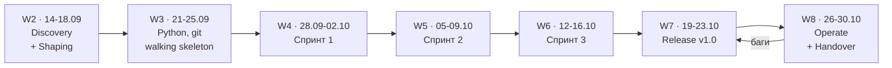
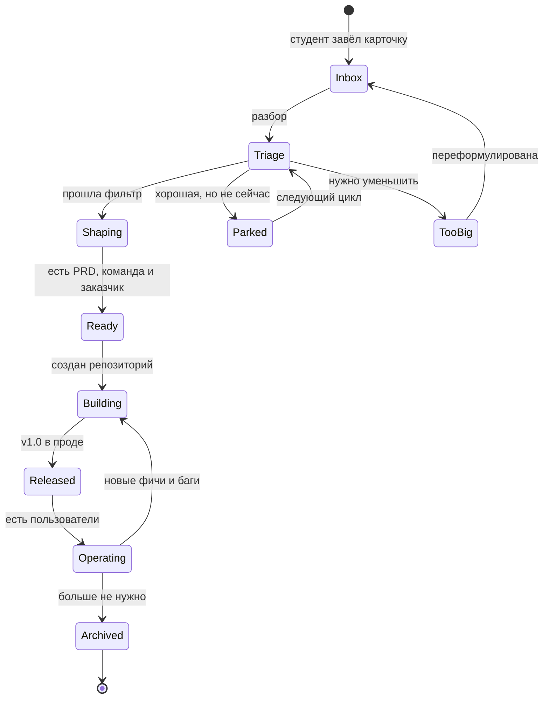
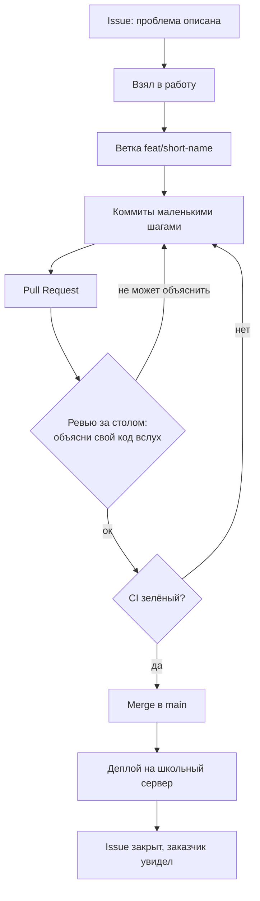

# RealSchoolHub — Roadmap

| | |
|---|---|
| Срок | 8 недель, финал **30.10.2026** |
| Формат | понедельник–пятница, **11:00–13:00** и **14:00–15:00** |
| Контакт | 3 часа в день, ~15 часов в неделю, **около 40 рабочих дней** |
| Студентов | 12 → 3 команды по 4 |
| Язык | Python ([почему только он](TEAM-SKILLS.md)) |
| Прод | школьный сервер |

Недели 1–2 прошли в формате одного занятия в неделю. **С недели 3 — ежедневный.** Это меняет
не сроки, а способ: обучение перестаёт быть лекцией с домашним заданием и становится работой
в мастерской, где преподаватель ходит между командами.

Схемы даны дважды: блоком `mermaid` и ASCII-версией — чтобы читалось в любом редакторе.

---

## 0. Принципы

1. **Инструмент вводится в день боли**, а не «потому что так в индустрии». При ежедневном
   формате это буквально: тема даётся в тот день, когда без неё встали.
2. **Ревью происходит в комнате.** Рядом с человеком, на его экране, в тот же час — не в виде
   комментариев к PR ночью.
3. **Вертикальный срез раньше глубины.** Сначала сквозной тонкий путь «вход → результат».
4. **Каждая пятница — работающая демонстрация** живому заказчику. Не слайды — запуск.
5. **Ничего не живёт в мессенджере и в разговоре.** Ежедневный контакт увеличивает соблазн
   держать решения в голове. Решение, которого нет в репозитории, не существует.
6. **Передача — фича, а не прощание.** Мейнтейнеры растятся с первой недели.

---

## 1. Три вложенных ритма

### День

```text
 11:00 ─────────────────── 13:00 ──────── 14:00 ──────── 15:00
 │  мини-тема (15 мин)          │  ПЕРЕРЫВ    │  работа команд  │
 │  работа команд               │  окно       │  ревью на месте │
 │  преподаватель ходит         │  заказчика  │  разбор, репо   │
 └──────────────────────────────┴─────────────┴─────────────────┘
```

- **Мини-тема** — максимум 15 минут в начале дня, и только если она сегодня нужна.
- **Перерыв 13:00–14:00** — постоянное окно для заказчиков. Они в здании; встреча с живым
  человеком не должна требовать отдельного слота.
- **14:00–15:00** — работа продолжается, преподаватель в это же время ведёт репозиторий
  и разбирает. Час в школе дешевле часа дома.

### Неделя

```text
  ПН            ВТ            СР            ЧТ            ПТ
  планирование  работа        работа        работа        ДЕМО заказчику
  разбор задач  ревью         ревью         подготовка    + ретро
                              к демо        + итоги в репозиторий
```

### Программа



```text
  W2      W3          W4       W5       W6       W7        W8
  выбор   Python+git  спринт1  спринт2  спринт3  релиз     эксплуатация
  тем     скелет      сценарий ошибки   CI       деплой    Demo Day
  команды на сервере  end2end  тесты    полировка v1.0     передача
    │         │          │        │        │        │          │
  заказчик  первая    демо     демо     демо     юзеры    инцидент
  найден    программа                                     + мейнтейнеры
```

---

## 2. Календарь

### W2 · 14–18.09 — Discovery и Shaping

Занятия 1–2 прошли: правила, рамки для идей, выдача ДЗ-1, разбор сданного.
**Занятие 3 (пятница 18.09)** — брейншторм по карточкам болей, поиск заказчиков в перерыве,
выбор 3 проектов, сбор команд. План: [LESSON-03.md](LESSON-03.md).

Это последнее занятие, планируемое поштучно: с недели 3 планы понедельные.

### W3 · 21–25.09 — Python, git, walking skeleton

Самая рискованная неделя программы: 7 человек из 11 не знают языка. Пять дней — достаточный
объём, чтобы дойти до работающей программы на сервере, но только если каждый день даёт
результат, который видно.

Подробный план по дням: **[WEEK-03.md](WEEK-03.md)**.

**Выход недели:** у каждой команды репозиторий, первый коммит от каждого участника,
и программа на школьном сервере — пусть тривиальная.

### W4 · 28.09–02.10 — Спринт 1: главный сценарий

Сквозной путь «вход → результат» для настоящей задачи проекта. Вводим ветки и Pull Request —
в тот день, когда двое впервые сломают друг другу код.

**Выход:** главный сценарий работает end-to-end. Демо заказчику в пятницу.

### W5 · 05–09.10 — Спринт 2: ошибки и края

Что происходит при пустом вводе, отсутствующем файле, выключенном сервере. Вводим тесты —
в день, когда починка одного сломает другое.

**Выход:** программа не падает на очевидном. Демо.

### W6 · 12–16.10 — Спринт 3: CI и полировка

GitHub Actions — в день, когда прозвучит «у меня работало». README, инструкция запуска,
подготовка релиза.

**Выход:** чужой человек запускает проект по README. Демо.

### W7 · 19–23.10 — Release

Тег `v1.0.0`, CHANGELOG, деплой на школьный сервер с автозапуском и логами, передача
пользователям, короткая инструкция на родном языке.

**Выход:** продукт в проде, у него есть пользователи, не входящие в команду.

### W8 · 26–30.10 — Operate и Handover

Дежурство по багам, приоритеты `p0…p3`, первый настоящий инцидент (при необходимости —
спровоцированный). Demo Day в четверг или пятницу. Передача мейнтейнерам.

**Выход:** два студента на проект с правами и `docs/MAINTENANCE.md`; учитель информатики —
owner организации; финальное ретро в репозитории.

---

## 3. Жизненный цикл идеи



```text
                    +---------+
   студент  ----->  |  INBOX  |  <-----------------------+
   завёл            +----+----+                          |
                         |  разбор                       | переформулировал
                         v                               |
                    +---------+      too-big      +------+------+
                    | TRIAGE  |------------------>|   TOO BIG   |
                    +----+----+                   +-------------+
                     |       \  не сейчас
            прошла   |        \-----------> +--------+
            фильтр   |                      | PARKED |---+ следующий отбор
                     v                      +--------+   |
                +---------+    <-------------------------+
                | SHAPING |  PRD + команда + заказчик
                +----+----+
                     v
                +---------+    +----------+    +-----------+    +-----------+
                |  READY  |--->| BUILDING |--->| RELEASED  |--->| OPERATING |
                +---------+    +----+-----+    +-----------+    +-----+-----+
                                    ^                                 |
                                    +----- баги и новые фичи ---------+
                                                                      |
                                                                      v
                                                               +----------+
                                                               | ARCHIVED |
                                                               +----------+
```

Из `Triage` **не бывает выхода «удалить»**. Идея либо едет, либо ждёт, либо уменьшается.
Автор всегда указан.

**Фильтр идеи** (проходит, если все «да»):

| Критерий | Проверка |
|---|---|
| Есть живой пользователь | Можно назвать имя и позвать в класс |
| Влезает в срок | Первая работающая версия за неделю работы |
| Влезает в стек | Python, школьный сервер |
| Безопасно | Нет персональных данных учеников |
| Бесплатно | Не требует покупок и платных сервисов |
| Проверяемо | Понятно, как измерить «стало лучше» |

---

## 4. Путь одной задачи

Вводится на неделе 4. Отличие от классического процесса: **ревью происходит вживую**, а PR —
это способ зафиксировать его результат, а не канал общения.



```text
  ISSUE --> взял --> ВЕТКА --> коммиты --> PULL REQUEST
                                               |
                                               v
                                   [ РЕВЬЮ ЗА СТОЛОМ ]
                                     объясни свой код вслух
                                      |            |
                              не объяснил        ок
                                      |            v
                                      |        [   CI   ]
                                      |         |      |
                                      |      красный  зелёный
                                      +<--------+      v
                                   (правим)         MERGE в main
                                                       |
                                                       v
                                                ДЕПЛОЙ на сервер
                                                       |
                                                       v
                                            ISSUE ЗАКРЫТ (заказчик видел)
```

**Definition of Done** (на стену и в шаблон PR):

1. Код в `main`, ветка удалена.
2. Автор объяснил каждую строку своими словами. Не смог — код не едет.
3. Запускается не только на его машине.
4. Если поведение видно пользователю — README обновлён.
5. Issue закрыт со ссылкой на PR.

Пункт 2 — это же и правило про AI-ассистентов: приносить можно любой код, защищать его
приходится самому.

---

## 5. Таблица «боль → инструмент»

Слева — событие, которого надо дождаться (или мягко спровоцировать), справа — что вводим
в тот же день. Читать сверху вниз: попытка внедрить строку 6 до строки 3 даёт бюрократию,
а не инженерию.

| # | Боль, которую они переживут сами | Инструмент | Когда |
|---|---|---|---|
| 0 | «Я не знаю языка, не могу начать» | Python — через задачу, не курсом | W3, пн–вт |
| 1 | «Я потерял рабочую версию, было же лучше» | `git commit`, история | W3, ср |
| 2 | «Как показать код товарищу и собрать вместе?» | GitHub, push, репозиторий команды | W3, чт |
| 3 | «У меня работает, а на сервере нет» | деплой, логи | W3, пт |
| 4 | «Мы одновременно правили один файл» | ветки, merge | W4 |
| 5 | «В main уехало нерабочее» | Pull Request + ревью за столом | W4 |
| 6 | «Забыли, кто что делает» | issues + доска | W4 |
| 7 | «Починили одно — сломали другое» | тесты | W5 |
| 8 | «У меня работало» | CI на GitHub Actions | W6 |
| 9 | «Новый человек не может запустить» | README, onboarding | W6 |
| 10 | «Какая версия сейчас на сервере?» | теги, CHANGELOG | W7 |
| 11 | «Оно упало, никто не знал» | дежурство, логи, автозапуск | W8 |
| 12 | «Заказчик хотел не это» | демо каждую пятницу | с W3 |

---

## 6. Что НЕ делаем

- **Домашние задания как основной канал.** При ежедневном формате работа идёт в классе.
  ДЗ остаётся для того, что делается вне школы: разговор с заказчиком, наблюдение.
- Story points, velocity, burndown, планирование покером.
- Ежедневные стендапы как ритуал. Понедельничное планирование — да; пятиминутка стоя каждый
  день при трёх часах контакта — лишняя.
- Jira и тяжёлые трекеры. GitHub Issues + одна доска.
- Микросервисы, Kubernetes, «настоящая архитектура». Один процесс, один файл конфига.
- Веб-фронтенд там, где в команде его никто не знает. CLI, TUI, бот, скрипт по cron —
  полноценные продукты.
- Автоматизация приёма работ (боты, PR-валидаторы). При ежедневном контакте экономит минуты,
  а стоит вечеров.

---

## 7. Контрольные точки

| Конец недели | Вопрос себе | Если «нет» |
|---|---|---|
| W2 | У каждого проекта есть имя заказчика? | Проект не стартует, кластер в `parked` |
| W3 | На сервере крутится что-то, написанное студентами? | Резать объём проектов немедленно |
| W4 | Главный сценарий работает end-to-end? | Резать до одного сценария |
| W5 | Заказчик видел работающее демо дважды? | Проект оторван от реальности |
| W6 | Чужой человек запускает по README? | Релиз под угрозой |
| W7 | Есть пользователь, который не студент? | Фазы поддержки не будет, признать честно |
| W8 | Два мейнтейнера на проект, кроме меня? | Проект умрёт после отъезда |

---

## 8. Открытые вопросы

- [ ] **Ревизия школьного сервера** — просрочена с недели 0, нужна до 25.09 (`docs/INFRA.md`)
- [ ] Согласие школы и родителей на публичные репозитории (`docs/POLICY.md`)
- [ ] Кто из учителей станет вторым owner организации
- [ ] Имена двух авторов работ ДЗ-1, оставшихся неподписанными
